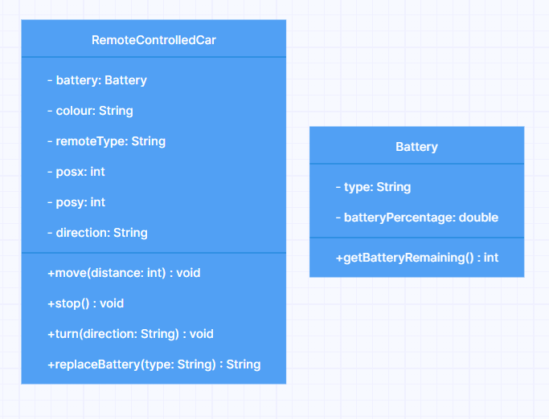

# Domain model Remote Controlled Car
### Class diagram:


#### Methods is in RemoteControlledCar class, unless mentioned otherwise
```
I have a remote controlled car:
```
#### /\ RemoteControlledCar class
```
I want to be able to decide on the colour of the car.
```
#### /\ colour field added to RemoteControlledCar class
```
I want to be able to choose between rechargable and disposable batteries.
```
#### /\ Battery class added with a type field, Battery added as field in RemoteControlledCar
```
I want to choose between a simple and an advanced remote control.
```
#### /\ remoteType field added to RemoteControlledCar
```
I want to be able to see the battery percentage remaining.
```
#### /\ batteryPercentage added to Battery class
| Class   | Method                | Variables                | Scenario | Return value/Output                                           |
|---------|-----------------------|--------------------------|----------|---------------------------------------------------------------|
| Battery | getBatteryRemaining() | double batteryPercentage |          | batteryPercentage field rounded to int (userfriendlyness :) ) |
```
I want to be able to move the car forward and backward a specific distance.
```
#### position fields added to RemoteControlledCar
| Method             | Variables | Scenario                                   | Return value/Output                           |
|--------------------|-----------|--------------------------------------------|-----------------------------------------------|
| move(int distance) | posx      | Number is negative, car is moved backwards | Returns void. posx and posy of car is updated |
|                    | posy      | Number is positive, car is moved forwards  |                                               |
```
I want to be able to stop the car from moving.
```
| Method | Variables | Scenario                             | Return value/Output                    |
|--------|-----------|--------------------------------------|----------------------------------------|
| stop() | posx      | stop is called on car standing still | Returns void. posx and posy reset to 0 |
|        | posy      | stop is called on car moved          | /\                                     |
```
I want to be able to turn the car left and right.
```
#### /\ direction field added to RemoteControlledCar
| Method                 | Variables        | Scenario                  | Return value/Output                         |
|------------------------|------------------|---------------------------|---------------------------------------------|
| turn(String direction) | String direction | Direction right is chosen | direction field is updated to new direction |

| direction options |
|-------------------|
| x                 |
| y                 |
| -x                |
| -y                |

```
I want to be able to replace the battery with either kind as needed.
```
| Method                      | Variables       | Scenario                                                                                      | Return value/Output                 |
|-----------------------------|-----------------|-----------------------------------------------------------------------------------------------|-------------------------------------|
| replaceBattery(String type) | Battery battery | battery is replaced to either rechargeable or disposable and battery percentage is reset to 1 | Battery changed to "type" message   |
|                             |                 | battery is replaced with none existing type                                                   | Battery type does not exist message |